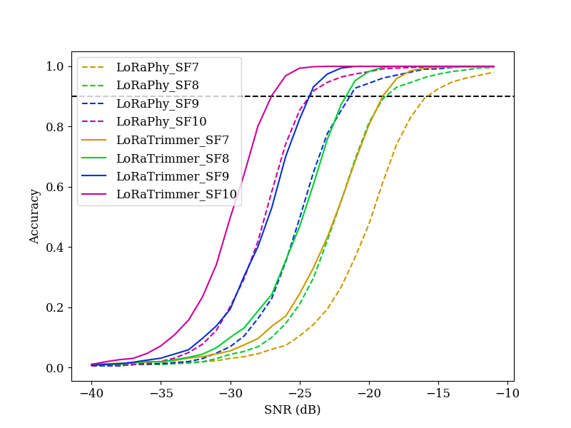

This repo provide source code for LoRaTrimmer: Optimal Energy Condensation with Chirp Trimming for LoRa Weak Signal Decoding \[Mobicom '24\]

Automated workflow also available on [Kaggle](https://www.kaggle.com/code/jialuodu/loratrimmer)

Usage:
1. Download dataset and unzip them from [Google Drive](https://drive.google.com/drive/folders/12o3kqfBGrWG2YWegBa-sqErpAUsmLIOO) as specified in this [Github Repo](https://github.com/daibiaoxuwu/NeLoRa_Dataset).
2. Install python3 and python3 packages from `requirements.txt `. If you have GPU available, install `cupy` to use it to accelerate run speed.
3. Set the dataset path in main.py to your unzipped location:
   
    ```python
    data_dir = '/path/to/NeLoRa_Dataset/'
    ```
5. Run main.py to plot accuracy comparison of the methods LoRaTrimmer and LoRaPhy on SF 7 to 10. Because we run two methods on the full dataset (around `27,000` symbols), it takes about 1.5 hours with GPU and 3 hours without. There will be progress bars for each SF for reading files and running (8 bars in total). You can reduce run time by either modifying the range of tested SNR at

   ```python
   snr_range = list(range(-40, -10))  # range of SNR for training   
   ```

   or manually remove some files from the downloaded dataset.
  
7. When run finished, it will generate a `result.png`. Result:

