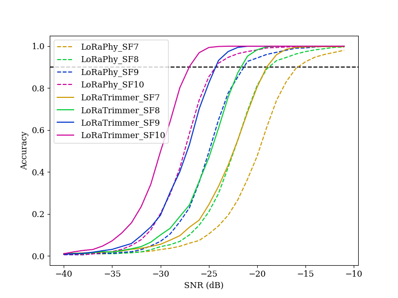

This repo provide source code for LoRaTrimmer: Optimal Energy Condensation with Chirp Trimming for LoRa Weak Signal Decoding \[Mobicom '24\]

Usage:
1. Download dataset and unzip them from [Google Drive](https://drive.google.com/drive/folders/12o3kqfBGrWG2YWegBa-sqErpAUsmLIOO) as specified in this [Github Repo](https://github.com/daibiaoxuwu/NeLoRa_Dataset).
2. Set the dataset path in main.py:
    ```python
    data_dir = '/path/to/NeLoRa_Dataset/'
    ```
3. Run main.py to plot accuracy comparison of the methods LoRaTrimmer and LoRaPhy on SF 7 to 10. Result:
